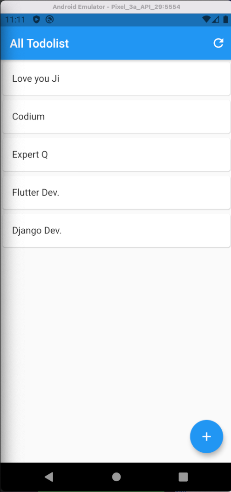

# todolist_q
Learning todolist application from Uncle.

### This Project has been used by Flutter 2 as details:

```
Flutter 2.2.3 • channel stable • https://github.com/flutter/flutter.git
Framework • revision f4abaa0735 (4 months ago) • 2021-07-01 12:46:11 -0700
Engine • revision 241c87ad80
Tools • Dart 2.13.4
```

---

## UI of the Todolist Application.

